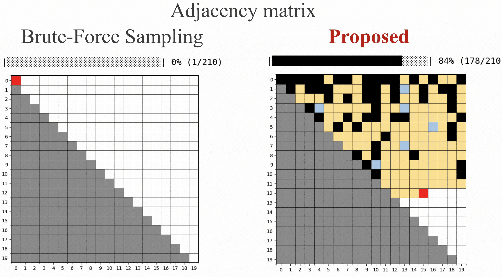

# FastMaxEnt: Fast Unbiased Sampling of Networks with Given Expected Degrees and Strengths

[](https://www.python.org/downloads/)
[](https://opensource.org/licenses/MIT)

FastMaxEnt implements fast and unbiased algorithms for generating network samples that:
- preserve the degree and strength sequences on expectation
- are statistically unbiased (the maximum entropy models)
- scale efficiently (effectively linear in time with respect to the number of edges)
- handle both weighted and unweighted networks

## How it works?



The **maximum entropy principle** provides a theoretically rigorous framework for generating unbiased random networks with prescribed degree and strength sequences.
It remedies the widely-used **Chung-Lu model** that samples edges between large-degree nodes more frequently than it should (see [this](https://iopscience.iop.org/article/10.1088/1367-2630/17/2/023052), [this](https://iopscience.iop.org/article/10.1088/1367-2630/16/4/043022), [this](https://arxiv.org/abs/1710.02733), and [this](https://www.sciencedirect.com/science/article/abs/pii/S0378437103008409)).
Despite its theoretical correctness, the maximum entropy model is not widely used in practice, leaving the Chung-Lu model as still only a viable choice.

We address this problem by proposing a fast sampling algorithm that works with the maximum entropy model. Our algorithm is an adaptation of the [Miller-Hagberg algorithm](https://link.springer.com/chapter/10.1007/978-3-642-21286-4_10) for the Chung-Lu model to the maximum entropy model.

Our algorithm adapts the **Miller-Hagberg algorithm** to MaxEnt models by using a two-stage approach: first sampling candidate edges, then selecting which ones to keep. By examining only candidate edges rather than all possible node pairs, we avoid the computational bottleneck and achieve 10-1000x speedup while maintaining statistical correctness. See [our paper](https://arxiv.org/abs/2509.13230) for technical details.


## Installation

### Using pip

#### From GitHub (Recommended)
```bash
pip install git+https://github.com/EKUL-Skywalker/fastmaxent.git
```

#### With Inference Dependencies
If you need parameter fitting capabilities (NEMtropy integration):
```bash
pip install git+https://github.com/EKUL-Skywalker/fastmaxent.git[inference]
```

### Using uv (Faster Alternative)

[uv](https://github.com/astral-sh/uv) is a fast Python package installer and resolver.

#### From GitHub
```bash
uv add git+https://github.com/EKUL-Skywalker/fastmaxent.git
```

#### With Inference Dependencies
```bash
uv add git+https://github.com/EKUL-Skywalker/fastmaxent.git[inference]
```

## Quick Start

Fastmaxent generates networks based on the maximum entropy models.
We first find the parameters using [NEMtropy](https://github.com/nicoloval/NEMtropy).

### Unweighted Example
```python
import numpy as np
from NEMtropy import UndirectedGraph
from fastmaxent import sampling

# Load your network data
edges = np.array([[0, 1], [0, 2], [1, 2]])
# Fit UBCM parameters using NEMtropy
graph = UndirectedGraph(edgelist=edges)
graph.solve_tool(model="cm", method="quasinewton", initial_guess="random")

# Extract parameters for FastMaxEnt
alphas = -np.log(graph.x)

# Sample networks preserving degree sequence
edge_list = sampling(alphas, weighted=False, n_samples=100)
```

### Weighted Example
```python
import numpy as np
from NEMtropy import UndirectedGraph, network_functions
from fastmaxent import sampling

import numpy as np
from NEMtropy import UndirectedGraph
from fastmaxent import sampling

# Load your network data
# The third column is the weight
edges = np.array([[0, 1, 1], [0, 2, 3], [1, 2, 2]])
# Fit UBCM parameters using NEMtropy
graph = UndirectedGraph(edgelist=edges)
graph.solve_tool(model="ecm", method="quasinewton", initial_guess="random")

# Extract parameters for FastMaxEnt
alphas = -np.log(graph.x)
betas = -np.log(graph.y)

# Extract parameters for FastMaxEnt
alphas = -np.log(graph.x)
betas = -np.log(graph.y)

# Sample networks preserving degree and strength sequences
networks = sampling(alphas, beta=betas, weighted=True, n_samples=100)
```

## API Reference

### `sampling(alpha, beta=None, weighted=False, n_samples=1)`

Generate network samples from UBCM or UECM models.

**Parameters:**
- `alpha` (numpy.ndarray): Degree constraint parameters for each node
- `beta` (numpy.ndarray, optional): Strength constraint parameters (required for weighted=True)
- `weighted` (bool): Whether to sample weighted networks (default: False)
- `n_samples` (int): Number of network samples to generate (default: 1)

**Returns:**
- `list`: List of network edge lists. For unweighted: `[source, target]`. For weighted: `[source, target, weight]`

## Command Line Interface

FastMaxEnt provides a CLI tool for parameter inference and network generation from edge tables.

### Usage

```bash
python -m fastmaxent.cli input.csv output_dir [options]
```

### Arguments

- `input.csv` - Path to CSV file containing edge table (required)
- `output_dir` - Directory to save generated network samples (required)

### Options

- `--n-samples N` - Number of random networks to generate (default: 10)
- `--weighted` - Treat network as weighted (use UECM model)
- `--delimiter CHAR` - CSV delimiter character (default: comma)

### Examples

#### Unweighted Network Sampling
```bash
# Generate 5 unweighted networks from edge table
python -m fastmaxent.cli network.csv output/ --n-samples 5

# Input CSV format (unweighted):
# source,target
# 0,1
# 0,2
# 1,2
```

#### Weighted Network Sampling
```bash
# Generate 10 weighted networks from weighted edge table
python -m fastmaxent.cli weighted_network.csv output/ --n-samples 10 --weighted

# Input CSV format (weighted):
# source,target,weight
# 0,1,2.5
# 0,2,1.0
# 1,2,3.2
```

The CLI automatically:
1. Loads the edge table from CSV
2. Infers UBCM/UECM parameters using NEMtropy
3. Generates random network samples using FastMaxEnt
4. Saves each sample as `network_sample_001.csv`, `network_sample_002.csv`, etc.

**Note:** The CLI requires NEMtropy for parameter inference. Install with:
```bash
pip install git+https://github.com/EKUL-Skywalker/fastmaxent.git[inference]
```

## Examples

Complete working examples are provided in the `examples/` directory:

- **[`examples/example.ipynb`](examples/example.ipynb)** - Comprehensive Jupyter notebook tutorial using Zachary's Karate Club network
  - Demonstrates both UBCM (unweighted) and UECM (weighted) sampling
  - Shows parameter fitting with NEMtropy
  - Includes degree and strength preservation verification
  - Visualization of results

#### Example jupyter notebook:
- `examples/example.ipynb` - Interactive tutorial

## Citation

If you use FastMaxEnt in your research, please cite our paper:

```bibtex
@article{li2025fast,
  title={Fast unbiased sampling of networks with given expected degrees and strengths},
  author={Xuanchi Li and Xin Wang and Sadamori Kojaku},
  journal={arXiv:2509.13230},
  year={2025}
}
```

## Requirements

- Python ≥ 3.9
- numpy ≥ 1.20.0
- numba ≥ 0.56.0
- Optional: nemtropy ≥ 3.0.0 (for parameter fitting examples)
